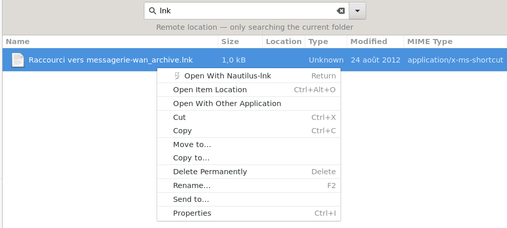
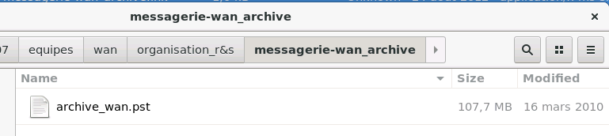

# my-lnk-tools
Tools and scripts to manage Windows shortcut under linux

## nautilus-lnk ##

 * open a lnk file with <code>lnkinfo</code> from liblnk-utils (Windows Shortcut File format access library -- Utilities)
 * get the NetPath
 * mount windows share with gnome-vfs (gio mount //server/share)
 * open nautilus on link destination
 

### installation

 * add nautilus-lnk.sh to local exec path : <code>cp  nautilus-lnk.sh /usr/local/bin/nautilus-lnk</code>
 * allow exec : <code>chmod +x /usr/local/bin/nautilus-lnk</code>
 * add App Helper to local (user) Applications Helper : <code>cp nautilus-lnk ~/.local/share/applications/</code>
 * optional : add App Helper with debug to local (user) Applications Helper : <code>cp nautilus-lnk-debug ~/.local/share/applications/</code>
 
